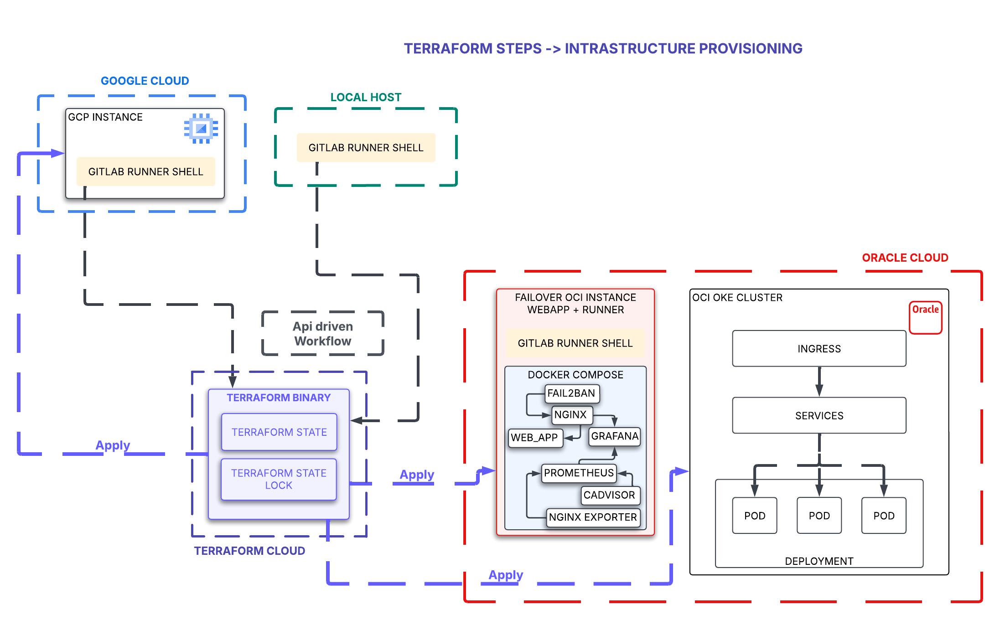

### Infrastructure diagram.
---

---
### First provision command (requires docker, oci cli, aws cli, gcloud cli, all of them already authenticated).
```
## oci profile policies
## oci packer profile policies
## comming soon 
```
```
## gcloud profile policies
## comming soon
```
```
## aws profile policies
## comming soon
```
```
gcloud auth login
aws configure
oci setup config

glab var set PACKER_WEBPORT_CLIENT_ID=<your_hcp_client_id>
glab var set PACKER_WEBPORT_CLIENT_SECRET=<your_hcp_client_secret>
cd iac
./webport-cli/.sh
```
### Get kubeconfig from cloud-cli (run this from docker container cloud-cli).
```
cd /app/terraform/prod
./modules/oci_oke_aways_free/get-kconfig.sh
```
### Copy kubeconfig from container cloud-cli to local machine (run this from local machine (docker container needs to be running)).
```
cd <project-folder>/iac
./terraform/prod/modules/oci_oke_aways_free/copy-kconfig-from-docker.sh
```
