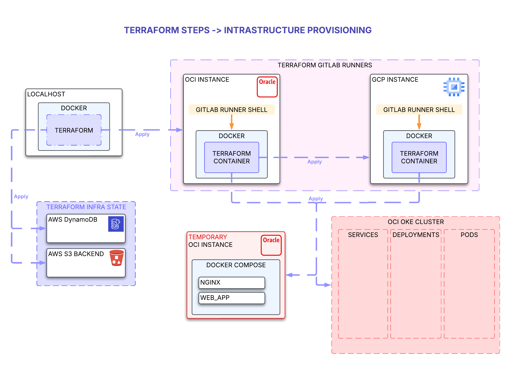

### Terraform infrastructure diagram.
---

---
### First provision command (requires docker, oci cli, aws cli, gclous cli, all of them already authenticated).
```
## oci profile policies
## oci packer profile policies
## comming soon
```
```
## gcloud profile policies
## comming soon
```
```
## aws profile policies
## comming soon
```
```
gcloud auth login
aws configure
oci setup config

glab var set PACKER_WEBPORT_CLIENT_ID=<your_hcp_client_id>
glab var set PACKER_WEBPORT_CLIENT_SECRET=<your_hcp_client_secret>
cd iac
./webport-cli/.sh
```
