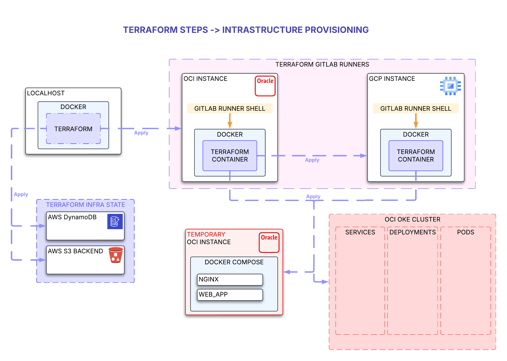

### Terraform Infrastructure diagram


### First provision command (requires docker locally).
```
docker run -it \
-v ~/.oci:/root/.oci \
-v ~/.aws:/root/.aws \
-v ~/.ssh:/root/.ssh \
-v ~/.gcp:/root/.gcp \
-v $PWD:/app \
-w /app \
--entrypoint "" hashicorp/terraform:latest sh -c "terraform init -reconfigure && sh"
```
